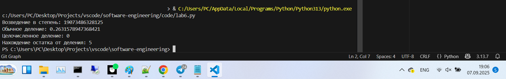
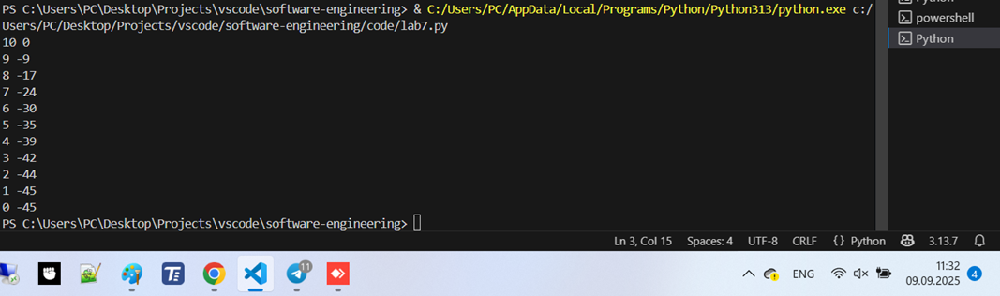
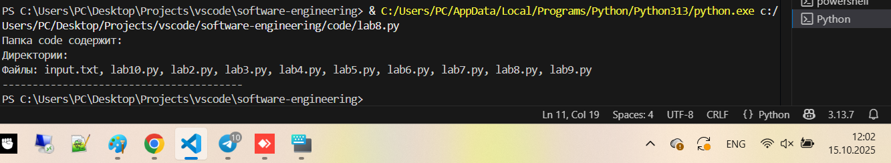
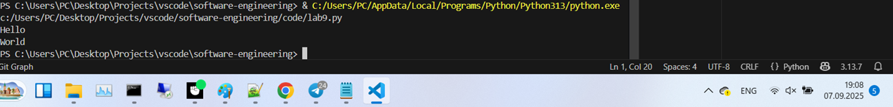
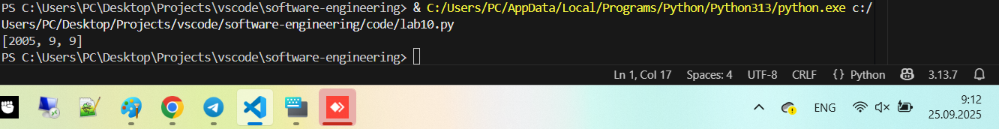

# Тема 3. Операторы, условия, циклы
Отчет по Теме #3 выполнил:
- Зенков Николай Андреевич
- ПИЭ-23-1

| Задание | Лаб_раб | Сам_раб |
| ------ |---------|---------|
| Задание 1 | +       | +       |
| Задание 2 | +       | +       |
| Задание 3 | +       | +       |
| Задание 4 | +       | +       |
| Задание 5 | +       | +       |
| Задание 6 | +       | -       |
| Задание 7 | +       | -       |
| Задание 8 | +       | -       |
| Задание 9 | +       | -       |
| Задание 10 | +       | -       |

знак "+" - задание выполнено; знак "-" - задание не выполнено;

Работу проверили:
- ассистент кафедры ИТиС, Ротенштрайх Т.В.

## Лабораторная работа №1
### Создайте две переменные, значение которых будете вводить через консоль. Также составьте условие, в котором созданные ранее переменные будут сравниваться, если условие выполняется, то выведете в консоль «Выполняется», если нет, то «Не выполняется».

```python
one = int(input('Введите значение 1-й переменной: '))
two = int(input('Введите значение 2-й переменной: '))
if one >= two:
    print('Выполняется')
else:
    print('Не выполняется')
```
### Результат.


### Выводы

Получили от пользователя две переменные и вывели результат в зависимости от значений этих переменных

## Лабораторная работа №2
### Напишите программу, которая будет определять значения переменной меньше 0, больше 0 и меньше 10 или больше 10. Это нужно реализовать при помощи одной переменной, значение которой будет вводится через консоль, а также при помощи конструкций if, elif, else.

```python
x = int(input('Введите значение переменной: '))
if x < 0:
    print(f'{x} < 0')
elif x > 0 and x < 10:
    print(f'0 < {x} < 10')
else:
    print(f'{x} > 10')
```
### Результат.


### Выводы

Получили от пользователя число и вывели диапазон, в котором оно находится

## Лабораторная работа №3
### Напишите программу, в которой будет проверяться есть ли переменная в указанном массиве используя логический оператор in. Самостоятельно посмотрите, как работает программа со значениями которых нет в массиве numbers.

```python
numbers = [1, 2, 3, 4, 5, 6, 7, 8, 9]
n = int(input('Введите число: '))
if n in numbers:
    print(f'Число {n} есть в массиве {numbers}')
else:
    print(f'Числа {n} нет в массиве {numbers}')
```
### Результат.


### Выводы

Получили от пользователя число и с помощью оператора `in` проверили, есть ли оно в массиве
  
## Лабораторная работа №4
### Напишите программу, которая будет определять находится ли переменная в указанном массиве и если да, то проверьте четная она или нет. Самостоятельно протестируйте данную программу с разными значениями переменной value.

```python
numbers = [1, 2, 3, 4, 5, 6, 7, 8, 9]
n = int(input('Введите число: '))
if n in numbers:
    if n % 2 == 0:
        print(f'Число {n} - четное и оно есть в массиве {numbers}')
    else:
        print(f'Числа {n} - нечетное и оно есть в массиве {numbers}')
else:
    print(f'Числа {n} нет в массиве {numbers}')
```
### Результат.


### Выводы

Получили от пользователя число и с помощью оператора `in` проверили, есть ли оно в массиве, а также четное ли оно (использовали оператор получения остатка от деления - `%`), и вывели правильное сообщение

## Лабораторная работа №5
### Напишите программу, в которой циклом for значения переменной i будут меняться от 0 до 10 и посмотрите, как разные виды сравнений и операций работают в цикле.

```python
for i in range(10):
    print(f'i = {i}')
    if i == 0:
        i += 2
    if i == 1:
        continue
    if i == 2 or i == 3:
        print('Переменная равна 2 или 3')
    elif i in [4, 5, 6]:
        print('Переменная равна 4, 5 или 6')
    else:
        break
```
### Результат.


### Выводы

Запустили цикл из 10 итераций. В цикле на каждой итерации выводили значение переменной `i` и в зависимости от ее значения делали разные действия

## Лабораторная работа №6
### Напишите программу, в которой при помощи цикла for определяется есть ли переменная value в строке string и посмотрите, как работает оператор else для циклов. Самостоятельно посмотрите, что выведет программа, если значение переменной value оказалось в строке string. Определять индекс буквы не обязательно, но если вы хотите, то это делается при помощи строки: index = string.find(value) Вы берете название переменной, в которой вы хотите что-то найти, затем применяете встроенный метод find() и в нем указываете то, что вам нужно найти. Данная строка вернет индекс искомого объекта.

```python
string = 'Привет всем изучающим Python!'
value = input()
for i in string:
    if i == value:
        index = string.find(value)
        print(f'Буква "{value}" есть в строке под {index}-м индексом')
        break
else:
    print(f'Буквы "{value}" нет в указанной строке')
```
### Результат.



### Выводы

Получили от пользователя букву для поиска, запустили цикл, внутри которого ищем индекс буквы в строке, или выводим, что такой буквы нет

## Лабораторная работа №7
### Напишите программу, в которой вы наглядно посмотрите, как работает цикл for проходя в обратном порядке, то есть, к примеру не от 0 до 10, а от 10 до 0. В уже готовой программе показано вычитание из 100, а вам во время реализации программы будет необходимо придумать свой вариант применения обратного цикла.

```python
value = 10
for i in range(10, -1, -1):
    value -= i
    print(i, value)
```
### Результат.



### Выводы

Использовали обратный цикл `for` с шагом -1

## Лабораторная работа №8
### Напишите программу используя цикл while, внутри которого есть какие-либо проверки, но быть осторожным, поскольку циклы while при неправильно написанных условиях могут становится бесконечными, как указано в примере далее.

```python
value = 0
while value < 100:
    if value == 0:
        value += 10
    elif value // 5 > 1:
        value *= 5
    else:
        value -= 5
    print(value)
```
### Результат.



### Выводы

Запустили цикл `while`, внутри которого в зависимости от переменной `value` делаем определенные действия, а также на каждой итерации выводим значение `value`

## Лабораторная работа №9
### Напишите программу с использованием вложенных циклов и одной проверкой внутри них. Самое главное, не забудьте, что нельзя использовать одинаковые имена итерируемых переменных, когда вы используете вложенные циклы.


```python
value = 0
for i in range(10):
    for j in range(10):
        if i != j:
            value += j
        else:
            pass
print(value)
```
### Результат.



### Выводы

Используем вложенный цикл и оператор `pass`, который ничего не делает

## Лабораторная работа №10
### Напишите программу с использованием flag, которое будет определять есть ли нечетное число в массиве. В данной задаче flag выступает в роли индикатора встречи нечетного числа в исходном массиве, четных чисел.

```python
even_array = [2, 4, 6, 8, 9]
flag = False
for value in even_array:
    if value % 2 == 1:
        flag = True
        break
if flag:
    print('В массиве есть нечетное число')
else:
    print('В массиве все числа четные')
```
### Результат.



### Выводы

Используем переменную `flag` для проверки, есть ли в массиве нечетное число. Оператор `break` используем для моментального выхода из цикла, чтобы не делать лишних итераций в случае, если хотя бы одно нечетное число уже нашлось в массиве

## Самостоятельная работа №1
### Задания для самостоятельного выполнения: 1) Напишите программу, которая преобразует 1 в 31.
### Для выполнения поставленной задачи необходимо обязательно и
### только один раз использовать:
### • Цикл for
### • *= 5
### • += 1
### Никаких других действий или циклов использовать нельзя.

```python
num = 1
for i in range(2):
    num *= 5
    num += 1
print(num)
```
### Результат.


### Выводы

Использовал цикл и операторы умножения и сложения.
  
## Самостоятельная работа №2
### Напишите программу, которая фразу «Hello World» выводит в
### обратном порядке, и каждая буква находится в одной строке консоли.
### Пример вывода в консоль:
### При этом необходимо обязательно использовать любой цикл, а также
### программа должна занимать не более 3 строк в редакторе кода.

```python
phrase = 'Hello World'
for i in range(len(phrase) - 1, -1, -1):
    print(phrase[i])
```
### Результат.


### Выводы

`for i in range(len(phrase) - 1, -1, -1):` - обратный цикл по строке
  
## Самостоятельная работа №3
### Напишите программу, на вход которой поступает значение из консоли, оно должно быть числовым и в диапазоне от 0 до 10 включительно (это
### необходимо учесть в программе). Если вводимое число не подходит по
### требованиям, то необходимо вывести оповещение об этом в консоль и
### остановить программу. Код должен вычислять в каком диапазоне
### находится полученное число. Нужно учитывать три диапазона:
### • от 0 до 3 включительно
### • от 3 до 6
### • от 6 до 10 включительно
### Результатом работы программы будет выведенный в консоль диапазон.
### Программа должна занимать не более 10 строчек в редакторе кода.

```python
num = int(input('Введите число от 0 до 10 включительно: '))
if not(0 <= num <= 10):
    print('Число не находится в требуемом диапазоне!')
else:
    if 0 <= num <= 3: print('Число находится в диапазоне от 0 до 3 включительно')
    elif 3 < num < 6: print('Число находится в диапазоне от 3 до 6')
    else: print('Число находится в диапазоне от 6 до 10 включительно')
```
### Результат.


### Выводы

C помощью конструкций `if`, `elif`, `else` выводим подходящее сообщение
  
## Самостоятельная работа №4
### Манипулирование строками. Напишите программу на Python, которая
### принимает предложение (на английском) в качестве входных данных
### от пользователя. Выполните следующие операции и отобразите
### результаты:
### • Выведите длину предложения.
### • Переведите предложение в нижний регистр.
### • Подсчитайте количество гласных (a, e, i, o, u) в предложении.
### • Замените все слова "ugly" на "beauty".
### • Проверьте, начинается ли предложение с "The" и заканчивается
### ли на "end".
### Проверьте работу программы минимум на 3 предложениях, чтобы
### охватить проверку всех поставленных условий.

```python
sentence = input('Введите предложение на английском языке: ')

matches = 'aeiou'
count = 0
for letter in sentence:
    if letter in matches: count += 1

print(len(sentence))
print(sentence.lower())
print(f'Количество гласных: {count}')
print(sentence.replace('ugly', 'beauty'))
print('Предложение начинается с "The"' if sentence.startswith('The') else 'Предложение не начинается с "The"')
print('Предложение заканчивается "end"' if sentence.endswith('end') else 'Предложение не заканчивается "end"')
```
### Результат.


### Выводы

1. `len(sentence)` - позволяет получить длину строки
2. `sentence.lower()` - преобразует строку к нижнему регистру
3. `sentence.replace("ugly", "beauty")` - заменяем все слова ugly на beauty
4. `sentence.startswith("The")` - проверяем, начинается ли предложение со слова "The"
5. `sentence.endswith("end")` - проверяем, заканчивается ли предложение словом "end"
  
## Самостоятельная работа №5
### Составьте программу, результатом которой будет данный вывод в
### консоль:
### Программу нужно составить из данных фрагментов кода:
### Строки кода можно использовать только один раз.
### Не обязательно использовать все строки кода.

```python
memory = ' world'
string = 'hello'
counter = 0
while counter != 10:
    print(string + memory)
    print(string)
    counter += 1
string = string + ' world'
memory = string
print(memory)
```
### Результат.


### Выводы

Использовал имеющиеся строки для создания программы

## Общие выводы по теме
Я вспомнил некоторые операции со строками, попрактиковался в использовании циклов и написал несколько своих программ.