# Тема 7. Работа с файлами (ввод и вывод)
Отчет по Теме #7 выполнил:
- Зенков Николай Андреевич
- ПИЭ-23-1

| Задание    | Лаб_раб | Сам_раб |
|------------|---------|---------|
| Задание 1  | +       | +       |
| Задание 2  | +       | +       |
| Задание 3  | +       | +       |
| Задание 4  | +       | +       |
| Задание 5  | +       | +       |
| Задание 6  | +       | -       |
| Задание 7  | +       | -       |
| Задание 8  | +       | -       |
| Задание 9  | +       | -       |
| Задание 10 | +       | -       |

знак "+" - задание выполнено; знак "-" - задание не выполнено;

Работу проверили:
- ассистент кафедры ИТиС, Ротенштрайх Т.В.

## Лабораторная работа №1
### Составьте текстовый файл и положите его в одну директорию с
### программой на Python. Текстовый файл должен состоять минимум из
### двух строк.

```python

```
### Результат.


### Выводы

Файл в директории.

## Лабораторная работа №2
### Напишите программу, которая выведет только первую строку из
### вашего файла, при этом используйте конструкцию open()/close().

```python
f = open('code/input.txt', 'r')
print(f.readline())
f.close()
```
### Результат.


### Выводы

`f.readline()` - чтение строки

## Лабораторная работа №3
### Напишите программу, которая выведет все строки из вашего файла в
### массиве, при этом используйте конструкцию open()/close().

```python
f = open('code/input.txt', 'r')
print(f.readlines())
f.close()
```
### Результат.


### Выводы

`f.readlines()` - чтение строк (список)
  
## Лабораторная работа №4
### Напишите программу, которая выведет все строки из вашего файла в
### массиве, при этом используйте конструкцию with open().


```python
with open('code/input.txt', 'r') as f:
    print(f.readlines())
```
### Результат.


### Выводы

`with open('code/input.txt', 'r') as f:` - открытие файла с помощью with

## Лабораторная работа №5
### Напишите программу, которая выведет каждую строку из вашего
### файла отдельно, при этом используйте конструкцию with open().


```python
with open('code/input.txt', 'r') as f:
    for line in f:
        print(line)
```
### Результат.


### Выводы
1. `with open('code/input.txt', 'r') as f:` - открытие файла с помощью with
2. `for line in f:` - итерируемся по строкам файла

## Лабораторная работа №6
### Напишите программу, которая будет добавлять новую строку в ваш
### файл, а потом выведет полученный файл в консоль. Вывод можно
### осуществлять любым способом. Обязательно проверьте сам файл, чтобы изменения в нем тоже отображались.


```python
with open('code/input.txt', 'a+') as f:
    f.write('\nТеперь тут 3 строки')

with open('code/input.txt', 'r') as f:
    lines = f.readlines()
    print(lines)
```
### Результат.

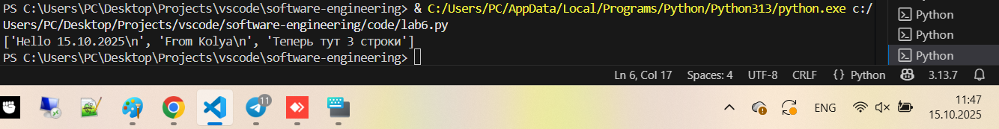
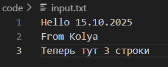

### Выводы

1. `with open('code/input.txt', 'a+') as f:` - открытие файла на чтение и запись с добавлением данных в конец, без удаления имеющихся данных 
2. `with open('code/input.txt', 'r') as f:` - открытие файла на чтение

## Лабораторная работа №7
### Напишите программу, которая перепишет всю информацию, которая
### была у вас в файле до этого, например напишет любые данные из
### произвольно вами составленного списка. Также не забудьте проверить
### что измененная вами информация сохранилась в файле.


```python
arr = ['one', 'two', 'three']
with open('code/input.txt', 'w') as f:
    for line in arr:
        f.write(f'\nCycle run {line}')
    print('Done!')
```
### Результат.

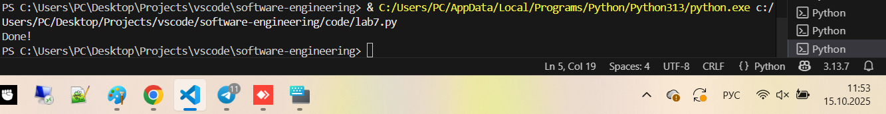
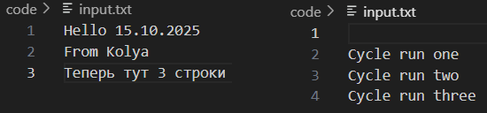

### Выводы

`with open('code/input.txt', 'w') as f:` - открытие файла на запись

## Лабораторная работа №8
### Выберите любую папку на своем компьютере, имеющую вложенные
### директории. Выведите на печать в терминал ее содержимое, как и всех
### подкаталогов при помощи функции print_docs(directory).


```python
import os

def print_docs(directory):
    all_files = os.walk(directory)
    for catalog in all_files:
        print(f'Папка {catalog[0]} содержит:')
        print(f'Директории: {", ".join([folder for folder in catalog[1]])}')
        print(f'Файлы: {", ".join([file for file in catalog[2]])}')
        print('-' * 40)

print_docs('code')
```
### Результат.


### Выводы

os.walk() обходит дерево каталогов и возвращает генератор кортежей, каждый из которых содержит имя каталога, списки вложенных каталогов и файлов

## Лабораторная работа №9
### Документ «input.txt» содержит следующий текст: Приветствие
### Спасибо
### Извините
### Пожалуйста
### До свидания
### Ты готов?
### Как дела?
### С днем рождения!
### Удача!
### Я тебя люблю.
### Требуется реализовать функцию, которая выводит слово, имеющее
### максимальную длину (или список слов, если таковых несколько).
### Проверьте работоспособность программы на своем наборе данных


```python
def longest_words(file):
    with open(file, encoding='utf-8') as f:
        words = f.read().split()
        max_length = len(max(words, key=len))
        for word in words:
            if len(word) == max_length:
                sought_words = word
        if len(sought_words) == 1:
            return sought_words[0]
        return sought_words
print(longest_words('code/input.txt'))
```
### Результат.

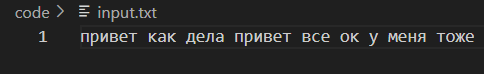
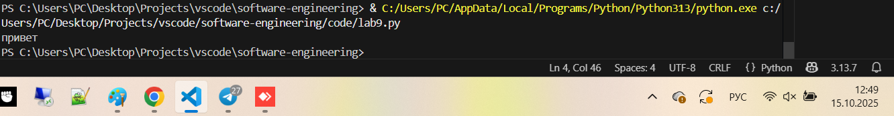

### Выводы

Вывод слова (слов) с максимальной длиной

## Лабораторная работа №10
### Требуется создать csv-файл «rows_300.csv» со следующими
### столбцами:
### • № - номер по порядку (от 1 до 300);
### • Секунда – текущая секунда на вашем ПК;
### • Микросекунда – текущая миллисекунда на часах.
### Для наглядности на каждой итерации цикла искусственно
### приостанавливайте скрипт на 0,01 секунды.


```python
import csv
import datetime
import time

with open('rows_300.csv', 'w', encoding='utf-8', newline='') as f:
    writer = csv.writer(f)
    writer.writerow(['№', 'Секунда', 'Микросекунда'])
    for line in range(1, 301):
        writer.writerow([line, datetime.datetime.now().second, datetime.datetime.now().microsecond])
        time.sleep(0.01)
```
### Результат.


### Выводы

Использовали csv для генерации файла с № теста, секундой и микросекундой

## Самостоятельная работа №1
### Найдите в интернете любую статью (объем статьи не менее 200
### слов), скопируйте ее содержимое в файл и напишите программу, которая считает количество слов в текстовом файле и определит
### самое часто встречающееся слово. Результатом выполнения задачи
### будет: скриншот файла со статьей, листинг кода, и вывод в консоль, в котором будет указана вся необходимая информация.

```python
from collections import Counter
import re
def count_words_in_file(filename):
    with open(filename, 'r', encoding='utf-8') as f:
        words = re.findall(r'\b\w+\b', f.read().lower())
        word_count = Counter(words)
        most_common_word = word_count.most_common(1)[0]
    return len(words), most_common_word
total_words, most_common_word = count_words_in_file("code/test.txt")
print(f"Всего слов в файле: {total_words}")
print(f"Самое частое слово: '{most_common_word[0]}', количество вхождений: {most_common_word[1]}")
```
### Результат.

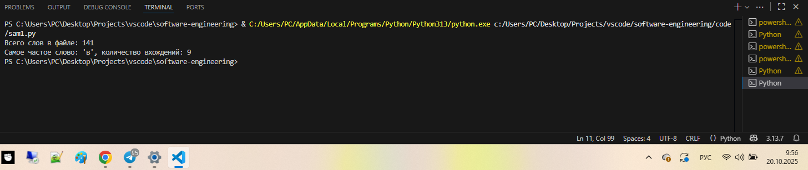
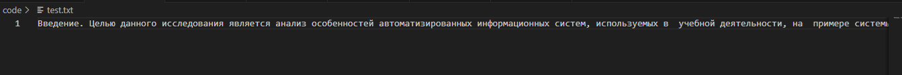

### Выводы

1. `import Counter` - импорт Counter для подсчета
2. `import re` - импорт re для поиска и извлечения всех совпадений с регулярными выражениями в строке
3. `words = re.findall(r'\b\w+\b', f.read().lower())` - применяем метод с регулярным выражением
4. `word_count = Counter(words)` - количество вхождений каждого слова
5. `most_common_word = word_count.most_common(1)[0]` - находим самое частое слово
  
## Самостоятельная работа №2
### У вас появилась потребность в ведении книги расходов, посмотрев
### все существующие варианты вы пришли к выводу что вас ничего не
### устраивает и нужно все делать самому. Напишите программу для
### учета расходов. Программа должна позволять вводить информацию
### о расходах, сохранять ее в файл и выводить существующие данные в
### консоль. Ввод информации происходит через консоль. Результатом
### выполнения задачи будет: скриншот файла с учетом расходов, листинг кода, и вывод в консоль, с демонстрацией
### работоспособности программы.

```python
def show_costs(filename):
    with open(filename, 'r', encoding='utf-8') as f:
        costs = f.readlines()
        if costs:
            print("Книга расходов:")
            for cost in costs:
                print(cost.strip())
        else:
            print("На данный момент расходов нет.")
def add_cost(filename):
    with open(filename, 'a', encoding='utf-8') as f:
        cost = input("Введите расход и сумму: ")
        f.write(cost + "\n")
add_cost("costs.txt")
add_cost("costs.txt")
add_cost("costs.txt")
show_costs("costs.txt")
```
### Результат.

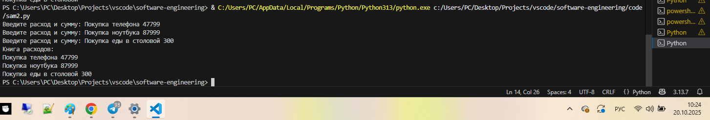
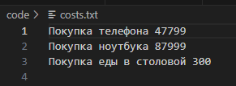

### Выводы

1. `f.write(cost + "\n")` - запись в файл информации о расходе и сумме
2. `print(expense.strip())` - вывод строки без пробелов
  
## Самостоятельная работа №3
### Имеется файл input.txt с текстом на латинице. Напишите программу, которая выводит следующую статистику по тексту: количество букв
### латинского алфавита; число слов; число строк.
### • Текст в файле:
### Beautiful is better than ugly.
### Explicit is better than implicit.
### Simple is better than complex.
### Complex is better than complicated.
### • Ожидаемый результат:
### Input file contains:
### 108 letters
### 20 words
### 4 lines


```python
import re
def show_text_stats(filename):
    with open(filename, 'r', encoding='utf-8') as f:
        lines = f.readlines()
        lines_count = len(lines)
        total_words = 0
        letter_count = 0
        for line in lines:
            total_words += len(line.split())
            letter_count += len(re.findall(r'[a-zA-Z]', line))
        print(f"Количество букв латинского алфавита: {letter_count}")
        print(f"Количество слов: {total_words}")
        print(f"Количество строк: {lines_count}")
show_text_stats("code/input.txt")
```
### Результат.

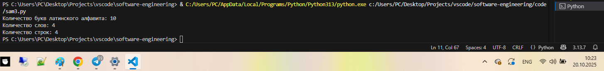
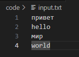

### Выводы

1. `lines = f.readlines()` - все строки в файле
2. `lines_count = len(lines)` - количество строк в файле
3. `total_words += len(line.split())` - подсчет слов в строке
4. `letter_count += len(re.findall(r'[a-zA-Z]', line))` - с помощью регулярного выражения находим количество латинских букв в строке
  
## Самостоятельная работа №4
### Напишите программу, которая получает на вход предложение, выводит его в терминал, заменяя все запрещенные слова
### звездочками * (количество звездочек равно количеству букв в
### слове). Запрещенные слова, разделенные символом пробела, хранятся в текстовом файле input.txt. Все слова в этом файле
### записаны в нижнем регистре. Программа должна заменить
### запрещенные слова, где бы они ни встречались, даже в середине
### другого слова. Замена производится независимо от регистра: если
### файл input.txt содержит запрещенное слово exam, то слова exam, Exam, ExaM, EXAM и exAm должны быть заменены на ****.
### • Запрещенные слова:
### hello email python the exam wor is
### • Предложение для проверки:
### Hello, world! Python IS the programming language of thE future. My EMAIL is....
### PYTHON is awesome!!!!
### • Ожидаемый результат:
### *****, ***ld! ****** ** *** programming language of *** future. My
### ***** **....
### ****** ** awesome!!!!


```python
import re
def get_forbidden_words(filename):
    with open(filename, 'r', encoding='utf-8') as f:
        words = f.read().split()
    return words
def blur_sentence(sentence, forbidden_words):
    for word in forbidden_words:
        pattern = re.compile(re.escape(word), re.IGNORECASE)
        sentence = pattern.sub('*' * len(word), sentence)
    return sentence

forbidden_words = get_forbidden_words("code/input.txt")
sentence = input("Введите предложение для проверки: ")
blured_sentence = blur_sentence(sentence, forbidden_words)
print("Результат:", blured_sentence)
```
### Результат.


### Выводы

1. `forbidden_words = f.read().split()` - получаем список запрещенных слов
2. `pattern = re.compile(re.escape(word), re.IGNORECASE)` - шаблон для поиска запрещенных слов без учета регистра
3. `sentence = pattern.sub('*' * len(word), sentence)` - заменяем запрещенные слова звездочками
4. `forbidden_words = get_forbidden_words("code/input.txt")` - чтение запрещенных слов из файла
  
## Самостоятельная работа №5
### Самостоятельно придумайте и решите задачу, которая будет
### взаимодействовать с текстовым файлом.

```python
def test(filename, qa_separator):
    if len(filename) == 0 or len(qa_separator) == 0:
        print('Переданы некорректные параметры.')
        return
    points = 0
    with open(filename, 'r', encoding='utf-8') as f:
        qa = [line.rstrip().split(qa_separator) for line in f.readlines()]
        print(qa)
        if len(qa) != 0:
            print('Начнем тестирование.')
            for i in range(len(qa)):
                print(f'----- Вопрос {i + 1} ------')
                print(qa[i][0])
                ans = input('Ваш ответ: ')
                if ans == qa[i][1]:
                    print('Вы ответили верно!')
                    points += 1
                else:
                    print('Вы ошиблись. :(')
                    print(f'Верный ответ: {qa[i][1]}')
        print(f'Верных ответов: {points} из {len(qa)}')
test('code/input.txt', '/')
```

### Результат.


### Выводы

Здесь реализован простейший функционал для тестирования с одним правильным ответом. В файле в каждой строке указывается вопрос, разделитель и правильный ответ. На вход метода подается путь к файлу и разделитель для строки с вопросом и ответом.

## Общие выводы по теме
Вспомнил основные методы для работы с файлами, некоторые режимы чтения/записи.