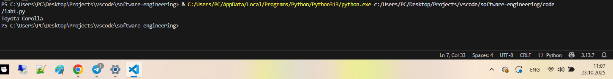
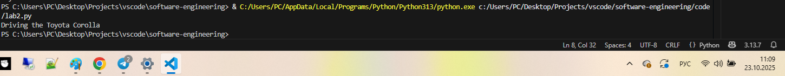
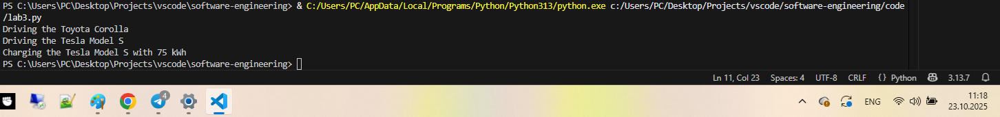
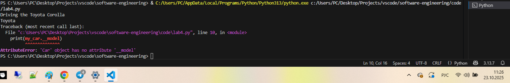
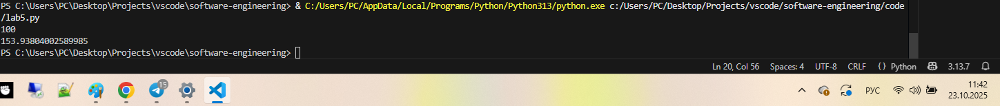
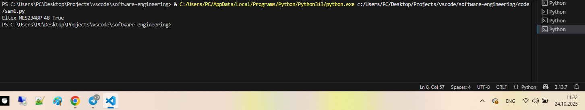
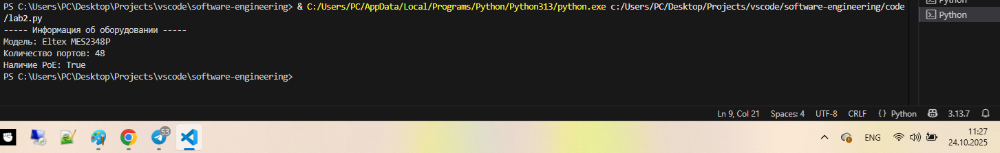
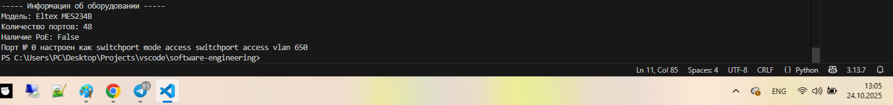
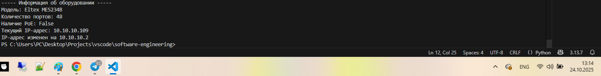
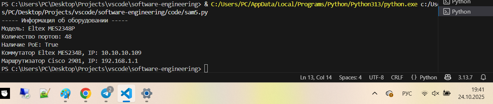

# Тема 8. Основы объектно-ориентированного программирования
Отчет по Теме #8 выполнил:
- Зенков Николай Андреевич
- ПИЭ-23-1

| Задание | Лаб_раб | Сам_раб |
| ------ |---------|---------|
| Задание 1 | +       | +       |
| Задание 2 | +       | +       |
| Задание 3 | +       | +       |
| Задание 4 | +       | +       |
| Задание 5 | +       | +       |

знак "+" - задание выполнено; знак "-" - задание не выполнено;

Работу проверили:
- ассистент кафедры ИТиС, Ротенштрайх Т.В.

## Лабораторная работа №1
### Создайте класс “Car” с атрибутами производитель и модель. Создайте
### объект этого класса. Напишите комментарии для кода, объясняющие
### его работу. Результатом выполнения задания будет листинг кода с
### комментариями.

```python
class Car:
    def __init__(self, make, model): # конструктор класса
        self.make = make # обращение к атрибуту класса
        self.model = model # обращение к атрибуту класса

my_car = Car('Toyota', 'Corolla') # вызываем конструктор класса, передаем параметры make и model
```
### Результат.



### Выводы

Создали класс `Car`, сделали для него конструктор с параметрами `make` и `model`; затем создали объект класса.

## Лабораторная работа №2
### Дополните код из первого задания, добавив в него атрибуты и методы
### класса, заставьте машину “поехать”. Напишите комментарии для кода, объясняющие его работу. Результатом выполнения задания будет
### листинг кода с комментариями и получившийся вывод в консоль.

```python
class Car:
    def __init__(self, make, model): # конструктор класса
        self.make = make # обращение к атрибуту класса
        self.model = model # обращение к атрибуту класса
    def drive(self): # создали метод
        print(f'Driving the {self.make} {self.model}')
my_car = Car('Toyota', 'Corolla') # вызываем конструктор класса, передаем параметры make и model
my_car.drive() # вызываем метод
```
### Результат.



### Выводы

Добавлен метод `drive`.

## Лабораторная работа №3
### Создайте новый класс “ElectricCar” с методом “charge” и атрибутом
### емкость батареи. Реализуйте его наследование от класса, созданного в
### первом задании. Заставьте машину поехать, а потом заряжаться.
### Результатом выполнения задания будет листинг кода с комментариями
### и получившийся вывод в консоль.

```python
from lab2 import Car
class ElectricCar(Car): # наследуемся от Car
    def __init__(self, make, model, batteryCapacity):
        super().__init__(make, model) # вызываем конструктор класса Car
        self.batteryCapacity = batteryCapacity # добавляем еще одно поле
    def charge(self): # добавляем еще один метод
        print(f'Charging the {self.make} {self.model} with {self.batteryCapacity} kWh')

myElectricCar = ElectricCar('Tesla', 'Model S', 75) # вызываем конструктор
myElectricCar.drive()
myElectricCar.charge()
```
### Результат.



### Выводы

Создан класс `ElectricCar`, который наследуется от `Car` и имеет метод `charge`
  
## Лабораторная работа №4
### Реализуйте инкапсуляцию для класса, созданного в первом задании.
### Создайте защищенный атрибут производителя и приватный атрибут
### модели. Вызовите защищенный атрибут и заставьте машину поехать.
### Напишите комментарии для кода, объясняющие его работу.
### Результатом выполнения задания будет листинг кода с комментариями
### и получившийся вывод в консоль.


```python
class Car:
    def __init__(self, make, model): # конструктор класса
        self._make = make # защищенный атрибут
        self.__model = model # приватный атрибут
    def drive(self): # создали метод
        print(f'Driving the {self._make} {self.__model}')
my_car = Car('Toyota', 'Corolla') # вызываем конструктор класса, передаем параметры make и model
my_car.drive()
print(my_car._make)
print(my_car.__model) # будет ошибка
```
### Результат.



### Выводы

Добавлена инкапсуляция: поле `_make` - защищенное, поле `__model` - приватное, поэтому при попытке обратиться к нему извне будет ошибка

## Лабораторная работа №5
### Реализуйте полиморфизм создав основной (общий) класс “Shape”, а
### также еще два класса “Rectangle” и “Circle”. Внутри последних двух
### классов реализуйте методы для подсчета площади фигуры. После этого
### создайте массив с фигурами, поместите туда круг и прямоугольник, затем при помощи цикла выведите их площади. Напишите
### комментарии для кода, объясняющие его работу. Результатом
### выполнения задания будет листинг кода с комментариями и
### получившийся вывод в консоль.


```python
import math
class Shape: # базовый класс
    def area(self):
        pass
class Rectangle(Shape): # класс прямоугольника
    def __init__(self, width, height): # конструктор принимает ширину и высоту
        self.width = width
        self.height = height
    def area(self):
        return self.width * self.height # вычисляем площадь
class Circle(Shape): # класс круга
    def __init__(self, radius): # конструктор принимает радиус
        self.radius = radius
    def area(self):
        return math.pi * math.pow(self.radius, 2) # вычислям площадь

myRect = Rectangle(10, 10) # создаем объект класса прямоугольник
myCircle = Circle(7) # создаем объект класса круг
print(myRect.area()) # выводим на экран площадь прямоугольника
print(myCircle.area()) # выводим на экран площадь круга
```
### Результат.



### Выводы

Базовый класс - `Shape`, от него наследуются `Rectangle` и `Circle`, у каждого из которых свои атрибуты и свой способ вычисления площади.

## Самостоятельная работа №1
### Самостоятельно создайте класс и его объект. Они должны
### отличаться, от тех, что указаны в теоретическом материале
### (методичке) и лабораторных заданиях. Результатом выполнения
### задания будет листинг кода и получившийся вывод консоли.

```python
class Switch:
    def __init__(self, model, portsCount, poe):
        self.model = model
        self.portsCount = portsCount
        self.poe = poe

mySwitch = Switch('Eltex MES2348P', 48, True)
print(mySwitch.model, mySwitch.portsCount, mySwitch.poe)
```
### Результат.



### Выводы

Я создал класс `Switch` (коммутатор), каждый объект которого имеет поля: модель (`model`), количество портов (`portsCount`) и наличие PoE (`poe`).
  
## Самостоятельная работа №2
### Самостоятельно создайте атрибуты и методы для ранее созданного
### класса. Они должны отличаться, от тех, что указаны в
### теоретическом материале (методичке) и лабораторных заданиях.
### Результатом выполнения задания будет листинг кода и
### получившийся вывод консоли.

```python
class Switch:
    def __init__(self, model, portsCount, poe):
        self.model = model
        self.portsCount = portsCount
        self.poe = poe
    def printInfo(self):
        print(f'----- Информация об оборудовании -----\nМодель: {self.model}\nКоличество портов: {self.portsCount}\nНаличие PoE: {self.poe}')
mySwitch = Switch('Eltex MES2348P', 48, True)
mySwitch.printInfo()
```
### Результат.



### Выводы

Метод `printInfo` красиво выводит информацию о коммутаторе.
  
## Самостоятельная работа №3
### Самостоятельно реализуйте наследование, продолжая работать с
### ранее созданным классом. Оно должно отличаться, от того, что
### указано в теоретическом материале (методичке) и лабораторных
### заданиях. Результатом выполнения задания будет листинг кода и
### получившийся вывод консоли.


```python
from sam2 import Switch
class ManageableSwitch(Switch):
    def __init__(self, model, portsCount, poe, ip, ports):
        super().__init__(model, portsCount, poe)
        self.ip = ip
        self.ports = ports
    def configurePort(self, portNumber, config):
        self.ports[portNumber] = config
        print(f'Порт № {portNumber} настроен как {config}')

myManageableSwitch = ManageableSwitch('Eltex MES234B', 48, False, '10.10.10.109', [''])
myManageableSwitch.printInfo()
myManageableSwitch.configurePort(0, 'switchport mode access switchport access vlan 650')
```
### Результат.



### Выводы

`class ManageableSwitch(Switch):` - наследование управляемого коммутатора от неуправляемого коммутатора; добавлены поля `ip` и `ports`, а также метод `configurePort`, позволяющий изменять настройки конкретного порта.
  
## Самостоятельная работа №4
### Самостоятельно реализуйте инкапсуляцию, продолжая работать с
### ранее созданным классом. Она должна отличаться, от того, что
### указана в теоретическом материале (методичке) и лабораторных
### заданиях. Результатом выполнения задания будет листинг кода и
### получившийся вывод консоли.

```python
from sam2 import Switch
class ManageableSwitch(Switch):
    def __init__(self, model, portsCount, poe, ip, ports):
        super().__init__(model, portsCount, poe)
        self.__ip = ip
        self.__ports = ports
    def configurePort(self, portNumber, config):
        self.__ports[portNumber] = config
        print(f'Порт № {portNumber} настроен как {config}')
    def setIP(self, newIP):
        self.__ip = newIP
        print(f'IP-адрес изменен на {newIP}')
    def getIP(self):
        return self.__ip

myManageableSwitch = ManageableSwitch('Eltex MES234B', 48, False, '10.10.10.109', [''])
myManageableSwitch.printInfo()
print(f'Текущий IP-адрес: {myManageableSwitch.getIP()}')
myManageableSwitch.setIP('10.10.10.2')
```
### Результат.



### Выводы

Я сделал поле `ip` приватным, а для чтения и изменения сделал методы `getIP` и `setIP`.
  
## Самостоятельная работа №5
### Самостоятельно реализуйте полиморфизм. Он должен отличаться, от того, что указан в теоретическом материале (методичке) и
### лабораторных заданиях. Результатом выполнения задания будет
### листинг кода и получившийся вывод консоли.

```python
from sam2 import Switch

class ManageableSwitch(Switch):
    def __init__(self, model, portsCount, poe, ip):
        super().__init__(model, portsCount, poe)
        self.__ip = ip
    def getInfo(self):
        return f"Коммутатор {self.model}, IP: {self.__ip}"

class Router(Switch):
    def __init__(self, model, portsCount, poe, ip):
        super().__init__(model, portsCount, poe)
        self.__ip = ip
    def getInfo(self):
        return f"Маршрутизатор {self.model}, IP: {self.__ip}"

def show_device_info(device):
    print(device.getInfo())

switch = ManageableSwitch("Eltex MES234B", 48, False, "10.10.10.109")
router = Router("Cisco 2901", 4, False, "192.168.1.1")

show_device_info(switch)
show_device_info(router)
```

### Результат.



### Выводы

Два разных класса имеют метод с одинаковым именем `getInfo()`. Функция `show_device_info()` может работать с любым объектом, у которого есть этот метод.

## Общие выводы по теме
Познакомился с классами, наследованием, инкапсуляцией и полиморфизмом, а также написал свой код по данной теме.